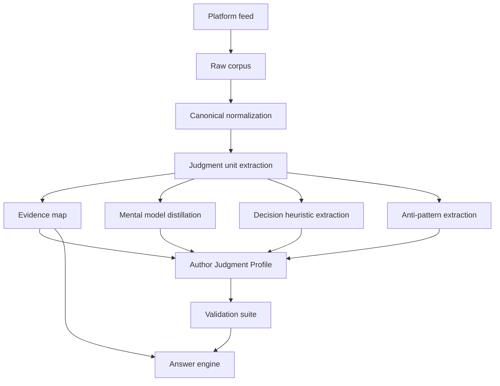

# Author Judgment Model

Author Judgment Model, abbreviated as AJM, is a framework for distilling an author's judgment capability from public historical information streams.

The target is not to clone the author's tone, style, catchphrases, emoji habits, or chat behavior. The target is to extract how the author judges: mental models, decision heuristics, anti-patterns, honest boundaries, evidence maps, and validation mechanisms.

## 1. Goal

AJM turns a historical feed from Weibo.com, X.com, or similar public platforms into a structured judgment model that can answer new questions with an evidence-bounded approximation of the author's reasoning logic.

The system should answer:

- What variables does this author repeatedly use when judging a topic?
- What causal chains do they rely on?
- What evidence do they consider strong or weak?
- What decisions do they tend to make under different conditions?
- What mistakes, traps, or false frames do they reject?
- Where does the historical corpus not support a confident answer?

## 2. Non-goals

AJM explicitly does not optimize for:

- Voice cloning.
- Persona roleplay.
- Emoji, catchphrase, tone, punctuation, or speaking-style imitation.
- Fine-tuning a model to sound like the author.
- Claiming to represent the author personally.
- Fabricating real-time facts not present in the source corpus.

The answer format may be clear and analytical even when the author's original posts are emotional, sarcastic, fragmented, or informal.

## 3. Core Capabilities

AJM must produce five first-class distillation capabilities.

### 3.1 Mental Models

Mental models are recurring cognitive frames the author uses across topics.

A valid mental model must pass three checks:

- Cross-domain recurrence: it appears across at least two domains or repeated cases.
- Generative power: it can predict how the author may reason about a new case.
- Exclusivity: it is more specific than generic common sense.

Example structure:

```yaml
id: market_clearing_vs_protected_stagnation
name: Market clearing versus protected stagnation
definition: The author judges industries by whether rules allow efficient players to win through price and efficiency, or force all players to stagnate together.
domains:
  - auto
  - real_estate
  - stock_market
variables:
  - pricing freedom
  - policy objective
  - weak-player protection
  - profit recovery
  - exit path
evidence_unit_ids:
  - unit_001
  - unit_078
  - unit_219
limitations:
  - Does not directly answer short-term price movement.
  - Requires current policy context before applying to live market decisions.
```

### 3.2 Decision Heuristics

Decision heuristics are compressed rules the author appears to use when choosing between actions.

They should include:

- Trigger condition.
- Priority variables.
- Default action tendency.
- Boundary condition.
- Supporting evidence.

Example:

```yaml
id: stop_adding_when_rules_change
trigger: The author detects that market rules or policy goals have changed against the original investment logic.
priority_variables:
  - policy direction
  - market clearing
  - pricing freedom
  - capital exit cost
default_action: Stop adding capital and observe.
boundary: This does not automatically mean immediate liquidation.
```

### 3.3 Anti-patterns

Anti-patterns are reasoning or action modes the author repeatedly rejects.

Examples:

- Treating investment tools as beliefs or identities.
- Using last year's success logic after rules have changed.
- Judging employment only by degree, major, or nominal prestige.
- Discussing public services only through moral appeals while ignoring funding and incentives.
- Entering choices with high sunk cost and poor exit paths.

Each anti-pattern should map to evidence and to the mental model it violates.

### 3.4 Honest Boundaries

Honest boundaries prevent overreach.

They must state:

- Corpus coverage limits.
- Topic domains with enough evidence.
- Topic domains with insufficient evidence.
- Whether the question requires real-time facts.
- Whether the answer is a historical reasoning simulation or an evidence-supported claim.

AJM should prefer saying "the corpus does not support a confident answer" over producing a fluent but unsupported answer.

### 3.5 Validation Mechanisms

AJM needs a validation suite, not just a narrative summary.

Required tests:

- Known-stance replay: can the model recover the author's historical reasoning on known examples?
- Cross-domain transfer: can a mental model explain multiple domains without becoming generic?
- Counterexample test: does the model know when not to apply a rule?
- Boundary test: does the model refuse or downgrade confidence when evidence is missing?
- Evidence trace test: can every major claim point back to source units?

## 4. System Architecture



## 5. Data Pipeline

### 5.1 Raw Collection

Platform adapters collect public or user-visible posts from sources such as Weibo.com and X.com.

Collection rules:

- Preserve original text and metadata.
- Record capture time, source URL, platform, and author ID.
- Do not read cookies, localStorage, passwords, or session files.
- Do not perform account actions such as liking, commenting, following, private messaging, or posting.
- Create backups before rewriting historical raw datasets.

Canonical raw post schema:

```json
{
  "platform": "weibo",
  "author_id": "2611641261",
  "author_handle": "example",
  "post_id": "post_id",
  "created_at": "2026-06-20T11:15:00+08:00",
  "text": "original post text",
  "post_type": "original|repost|quote|reply",
  "context_text": "quoted or reposted text if available",
  "url": "https://weibo.com/...",
  "engagement": {
    "likes": 0,
    "comments": 0,
    "reposts": 0
  },
  "capture": {
    "captured_at": "2026-06-20T14:00:00+08:00",
    "method": "chrome_visible_dom",
    "coverage_note": "profile visible range only"
  }
}
```

### 5.2 Judgment Unit Extraction

A judgment unit is the smallest evidence-backed reasoning fragment.

Schema:

```json
{
  "unit_id": "unit_000001",
  "source_post_id": "post_id",
  "created_at": "2026-06-20T11:15:00+08:00",
  "domain": "stock_market",
  "claim": "Investment tools should not be treated as emotional commitments.",
  "object": "stocks, real estate, gold, deposits, foreign exchange",
  "stance": "neutral_tool_view",
  "variables": [
    "legality",
    "profit_loss",
    "liquidity",
    "exit_cost"
  ],
  "causal_chain": [
    "tool identity attachment",
    "reduced exit discipline",
    "worse capital allocation"
  ],
  "decision_rule": "Treat investment objects as tools and exit when logic breaks.",
  "anti_patterns": [
    "falling in love with an investment vehicle"
  ],
  "confidence": "medium",
  "evidence_strength": "direct"
}
```

### 5.3 Evidence Map

Evidence maps connect conclusions to supporting and conflicting units.

Schema:

```yaml
domain: stock_market
core_judgment: Investment vehicles are tools, not beliefs.
supporting_units:
  - unit_000001
  - unit_000104
conflicting_units: []
key_variables:
  - policy direction
  - valuation
  - profit realization
  - capital flow
  - exit cost
boundary:
  - Historical reasoning cannot replace real-time market data.
  - Short-term price predictions require external market evidence.
confidence: high
```

### 5.4 Author Judgment Profile

The profile is the main distillation artifact.

Recommended file:

`profiles/{platform}-{author_id}/author-judgment-profile.yaml`

Required sections:

- Coverage summary.
- Domain map.
- Mental models.
- Decision heuristics.
- Anti-patterns.
- Honest boundaries.
- Evidence map references.
- Validation results.
- Update history.

## 6. Answer Engine

The answer engine should not imitate the author. It should answer with the author's distilled judgment logic.

Recommended answer structure:

1. Direct answer.
2. Question classification.
3. Likely judgment model.
4. Key variables.
5. Evidence trace.
6. Action tendency.
7. Boundaries and confidence.

For interpretation questions, first answer the exact sentence or question before abstracting.

For real-time factual questions, separate:

- Historical reasoning from AJM.
- Current facts that require external lookup.
- Unsupported claims that should not be inferred.

## 7. Validation Suite

Validation cases should be stored as machine-readable fixtures.

Example:

```yaml
case_id: known_stance_001
question: "How would this author judge buying a house mainly because prices used to rise?"
expected_models:
  - tool_not_belief
  - avoid_carving_boat_for_old_rules
expected_variables:
  - liquidity
  - rent_to_price_ratio
  - city_opportunity
  - exit_cost
must_not_include:
  - guaranteed_price_prediction
  - author_personal_claim
pass_criteria:
  - cites evidence units
  - distinguishes self-use from investment
  - states confidence boundary
```

## 8. Latest Single-Author Execution Scheme

The current executable single-author AJM scheme is implemented in this repository. The latest plan is not the raw prototype. The source of truth is:

- CLI entrypoint: `scripts/ajm.js`
- Weibo pipeline guide: `docs/single-author-weibo.md`
- Repeatable execution runbook: `docs/single-author-runbook.md`
- Tests: `tests/pipeline.test.js`
- Latest strict San Shu package: `dist/weibo-2611641261-pruned/package`

### 8.1 Standard Flow

For a Weibo author, the latest execution flow is:

1. Normalize raw Weibo rows into canonical posts.
2. Extract judgment units.
3. Build evidence maps and an author judgment profile.
4. Generate a review pack and quality gate.
5. Generate or run validation cases and persist validation results.
6. Apply manual review corrections when needed.
7. If low-confidence units remain high, build a stricter pruned unit.
8. Package the resulting unit as Agent Prompt, Skill, and QA artifacts.

Recommended command for a complete first build:

```sh
node scripts/ajm.js build-weibo-author-unit \
  --raw /path/to/raw-index.json \
  --author-id 2611641261 \
  --author-handle sanshu \
  --out dist/weibo-2611641261 \
  --config configs/weibo.default.json
```

If no hand-written validation cases exist yet, generate a baseline validation set:

```sh
node scripts/ajm.js generate-validation-cases \
  --profile dist/weibo-2611641261/data/profiles/weibo-2611641261/author-judgment-profile.json \
  --config configs/weibo.default.json \
  --out dist/weibo-2611641261/validation/validation-cases.generated.json \
  --max-domains 6 \
  --case-prefix sanshu
```

Then run and persist validation:

```sh
node scripts/ajm.js apply-validation-results \
  --cases dist/weibo-2611641261/validation/validation-cases.generated.json \
  --profile dist/weibo-2611641261/data/profiles/weibo-2611641261/author-judgment-profile.json \
  --units dist/weibo-2611641261/data/judgment-units/weibo-2611641261/judgment-units.json \
  --config configs/weibo.default.json \
  --validation-id sanshu_baseline_generated_001
```

If quality gate warns on `high_low_confidence_unit_ratio`, create a strict package:

```sh
node scripts/ajm.js prune-weak-units \
  --posts dist/weibo-2611641261/data/normalized/weibo-2611641261/posts.json \
  --units dist/weibo-2611641261/data/judgment-units/weibo-2611641261/judgment-units.json \
  --profile dist/weibo-2611641261/data/profiles/weibo-2611641261/author-judgment-profile.json \
  --out dist/weibo-2611641261-pruned \
  --config configs/weibo.default.json \
  --author-id 2611641261 \
  --author-handle sanshu
```

Package the strict unit:

```sh
node scripts/ajm.js package-author \
  --profile dist/weibo-2611641261-pruned/data/profiles/weibo-2611641261/author-judgment-profile.json \
  --units dist/weibo-2611641261-pruned/pruned-judgment-units.json \
  --config configs/weibo.default.json \
  --out dist/weibo-2611641261-pruned/package
```

### 8.2 Review and Correction

Manual review is a first-class correction layer:

- `review-pack` creates sampled units, checklist, report, quality gate, and `manual-review-template.json`.
- `apply-review` records review status into `profile.review_results`.
- `apply-review-corrections` removes rejected units, annotates units needing revision, rebuilds evidence maps/profile, reruns quality gate, and writes `correction-report.json`.

### 8.3 Quality Gate Behavior

Quality gate status has release semantics:

- `pass`: package is ready for normal local use.
- `warn`: package is usable for review or exploratory work, but should be corrected, validated, or pruned before serious use.
- `fail`: `build-weibo-author-unit` blocks package generation by default.

Use `--allow-package-on-fail true` only for local debugging.

### 8.4 Latest San Shu Status

Current verified San Shu outputs:

- Wide coverage unit: `dist/weibo-2611641261`
  - 3447 judgment units.
  - 6 mental models.
  - Baseline validation persisted.
  - Quality gate: `warn` because low-confidence unit ratio remains high.
- Strict unit: `dist/weibo-2611641261-pruned`
  - 1204 judgment units.
  - 6 mental models.
  - Baseline validation: 7/7 pass.
  - Quality gate: `pass`, score 100.
  - Agent/Skill/QA package: `dist/weibo-2611641261-pruned/package`.

For serious single-author use, prefer the strict package unless broad recall is more important than noise control.

## 9. Current Project Structure

```text
Author Judgment Model/
  README.md
  docs/
    single-author-weibo.md
  schemas/
    raw-post.schema.json
    judgment-unit.schema.json
    author-judgment-profile.schema.json
    evidence-map.schema.json
    validation-case.schema.json
  data/
    normalized/
    judgment-units/
    evidence-maps/
    profiles/
    validation/
    llm-batches/
  dist/
    weibo-2611641261/
    weibo-2611641261-pruned/
  scripts/
    ajm.js
    lib/
  configs/
    weibo.default.json
  tests/
    pipeline.test.js
```

## 10. Nuwa Integration Boundary

AJM should absorb Nuwa-style distillation discipline, not Nuwa-style persona packaging.

Adopt:

- Staged extraction workflow.
- Mental model validation by recurrence, generative power, and exclusivity.
- Decision heuristics.
- Anti-patterns.
- Honest boundaries.
- Known-stance sanity checks.
- Edge-case uncertainty checks.

Exclude by default:

- Expression DNA.
- Voice checks.
- Catchphrase imitation.
- Roleplay framing.
- Style cloning.

## 11. First Migration Target

The existing San Shu Weibo project has been migrated into the standalone AJM project.

Source:

`./examples/weibo-2611641261/raw-index.json`

Migrated outputs:

- `data/normalized/weibo-2611641261/posts.json`
- `data/judgment-units/weibo-2611641261/judgment-units.json`
- `data/evidence-maps/weibo-2611641261/evidence-maps.json`
- `data/profiles/weibo-2611641261/author-judgment-profile.json`
- `dist/weibo-2611641261/package`
- `dist/weibo-2611641261-pruned/package`

The latest strict package replaces the old hard-coded simulator as the recommended local use artifact.

## 12. Acceptance Criteria

An author profile is acceptable only when:

- It has at least three validated mental models.
- Each mental model has source evidence and limitations.
- It has explicit decision heuristics and anti-patterns.
- It states honest boundaries clearly.
- It passes known-stance replay tests.
- It can answer new questions with evidence references.
- It refuses or downgrades confidence on unsupported topics.
- It does not imitate voice, tone, emoji, or catchphrases.

For a packaged single-author unit, release readiness additionally requires:

- Quality gate is `pass`, or documented as `warn` for exploratory use only.
- Validation results are persisted in the profile.
- Review and correction workflow is available for sampled evidence issues.
- Agent/Skill/QA package files are generated from the same profile and unit set.
- No mixing of wide and pruned artifacts across package files.

## 13. Current Status

The single-author Weibo AJM implementation is extracted and executable.

Implemented:

- Schema files for raw posts, judgment units, evidence maps, author profiles, and validation cases.
- Weibo normalization and deterministic baseline judgment-unit extraction.
- Optional LLM batch export/import/rebuild path.
- Review pack generation.
- Manual review writeback and correction rebuild.
- Validation case generation, run, and profile writeback.
- Quality gate with package blocking on `fail`.
- Weak-unit pruning for strict low-noise packages.
- Agent Prompt, Skill, and QA package generation.

Current verified package:

`dist/weibo-2611641261-pruned/package`

Remaining enhancement, not a blocker for the current single-author unit:

- Add more hand-written known-stance validation cases for high-value topics.
- Use reviewed LLM extraction if broader coverage is needed without increasing weak-unit noise.
